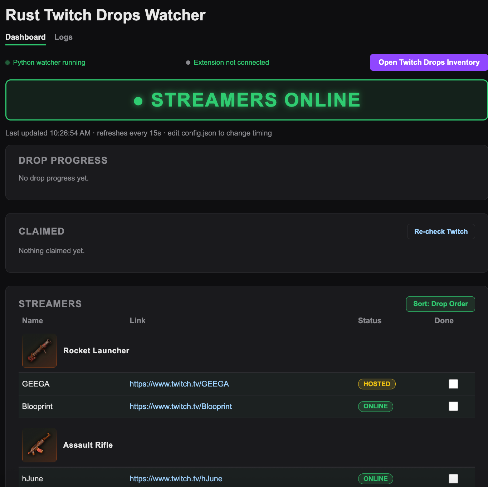

## Auto Rust Twitch Drops

<p align="center">
  
</p>

### Windows quick start (no Python knowledge needed)

1. Download this project (green **Code** button, then **Download ZIP**) and extract it.
2. Double click **`start.bat`**.

On the first launch, `start.bat` will:

1. Install Python 3.11.9 for your user account if you don't have it. No admin rights are needed.
2. Create a private `.venv` folder inside the project and install the required libraries there, so your other Python setups are not touched.
3. Walk you through loading the Chrome extension. It opens the extension folder and the Chrome extensions page for you, then waits while you follow the steps.
4. Open your Twitch drops inventory, start the watcher and open the dashboard.

Later launches skip the setup and start in a few seconds. Close the window to stop the watcher.

If Windows shows "Windows protected your PC", click **More info**, then **Run anyway**.

### Run manually with Python

#### 1. Install Python 3.11 (I use 3.11.9)
Download it from https://www.python.org/downloads/ and tick "Add python.exe to PATH" in the installer.

#### 2. Install the required libraries
Copy and paste this into Command Prompt:
```bash
pip install requests beautifulsoup4
```

#### 3. Install the Chrome extension
1. Open `chrome://extensions` in Chrome.
2. Turn on **Developer mode** in the top right.
3. Click **Load unpacked** and pick the `extension` folder from this project.

After updating the project, click **Reload** on the extension in `chrome://extensions`.

#### 4. Run the script
Run `autoRustDrops_v0.0.4.py`. It opens the dashboard in your browser once the first check is done.

#### 5. Keep the Twitch inventory open
Keep a tab open on https://www.twitch.tv/drops/inventory while the watcher runs. The dashboard's "Open Twitch Drops Inventory" button opens it for you.

## Settings

The script creates `config.json` the first time it runs. You can edit it while the program is running, and changes are picked up on the next cycle.

1. `recheck_interval_minutes` (default 30): how long to wait before checking again when nobody eligible is live.
2. `no_progress_wait_minutes` (default 15): how long to watch a streamer before Twitch shows any progress for their drop.
3. `page_refresh_seconds` (default 15): how often the dashboard refreshes.
4. `claimed_max_age_days` (default 21): claims on Twitch older than this are treated as belonging to past campaigns and ignored.
5. `twitch_item_map` (default empty): fixes for rewards the watcher can't match. If the log says it couldn't match a Twitch item, add an entry like `"Twitch item name": "facepunch drop name"`, or map it to `""` to ignore it.

## Files

1. `start.bat`: the Windows launcher.
2. `autoRustDrops_v0.0.4.py`: the watcher.
3. `extension`: the Chrome extension.
4. `config.json`: your settings.
5. `claimed.json`: streamers whose drops you have claimed.
6. `dashboard.html`, `logs.html`, `style.css`: the web pages the watcher serves.
7. `requirements.txt`: the Python libraries the watcher needs.


# Twitch Rust Drops Watcher
DISCLAIMER IN BETA

Rust Drops Watcher finds every Twitch streamer taking part in the current Rust drops campaign. It reads your real drop progress from Twitch and opens the right live stream in your browser. When a drop finishes or the streamer goes offline, it moves on to the next one. It keeps going until every drop is done.

## Features

1. Reads the current drop streamers, their teams and their rewards from [twitch.facepunch.com](https://twitch.facepunch.com), and shows who is live or offline.
2. Reads your drop progress from your [Twitch inventory](https://www.twitch.tv/drops/inventory) through a small Chrome extension, so it knows which drops are started, finished or already claimed.
3. Picks the best stream to watch. Drops you have already started come first, with the one closest to done winning, so a drop at 98% gets finished before a new one is started. Unstarted drops follow in the order they appear on the facepunch page.
4. Works out how much watch time is left from your progress. For example, 45% of a 120 minute drop leaves about 66 minutes.
5. Opens the chosen stream in your default browser, then switches as soon as that drop completes, the streamer goes offline or the drop gets claimed.
6. Handles team drops. Streamers on the same facepunch card share one reward, so progress and claims count for the whole team.
7. Closes old stream tabs on its own, so tabs don't pile up on long runs.
8. Runs a live dashboard in your browser at http://127.0.0.1:8787 showing who is being watched, each streamer's status and progress, and your claimed drops.
9. Has a Logs page with Start, Pause and Stop buttons and a console that shows everything the watcher does.
10. Lets you mark a streamer as claimed by hand, or undo it. Your claims are saved in `claimed.json` and kept between runs.
11. Waits and checks again later when nobody eligible is live (every 30 minutes by default).
12. On Windows, sets itself up and starts with a double click on `start.bat`, including installing Python if you don't have it.

## How It Works

The program is made of three parts that work together.

**The Python script** (`autoRustDrops_v0.0.4.py`) does the main work. Each cycle it downloads the facepunch drops page, works out which streamers are live and which reward each one gives, and combines that with your Twitch progress. It then decides who to watch and opens that stream. While it is watching someone, it checks again every minute. When nobody is eligible it waits for the recheck interval. It also runs a small web server on your own computer (port 8787, reachable only from your machine) that serves the dashboard and logs pages.

**The Chrome extension** (`extension` folder, named "Rust Drops Bridge") connects your browser to the script. Twitch only shows drop progress to your logged in browser, so the script cannot read it directly. The extension reads your Twitch inventory page and sends that data to the script. It reloads the inventory tab every 5 minutes to pick up new progress. Every 30 seconds it asks the script which streams are finished and closes those tabs. The script only accepts data from a Chrome extension, so no website can send it fake data.

**The dashboard and logs pages** show you what is happening and let you control it. The dashboard updates itself while it is open. The Logs page has the Start, Pause and Stop controls and the full activity log.

No streams are opened until the extension has sent its first inventory update. Without that data every drop would look unclaimed, and the watcher could rewatch drops you already have. Once data arrives, the dashboard shows "Twitch synced".


## Disclaimer

This project is a personal automation tool designed to help users manage Twitch Drops progress more easily.

1. This project is not affiliated with Twitch or Facepunch Studios in any way.
2. It does not simulate viewership, interact with the Twitch player, or manipulate drop systems.
3. It only automates opening eligible Twitch streams, based on public web pages, your own inventory and estimated watch time.
4. Use of this tool is at your own risk. Be sure to comply with Twitch's Terms of Service and Drops Program Guidelines.
